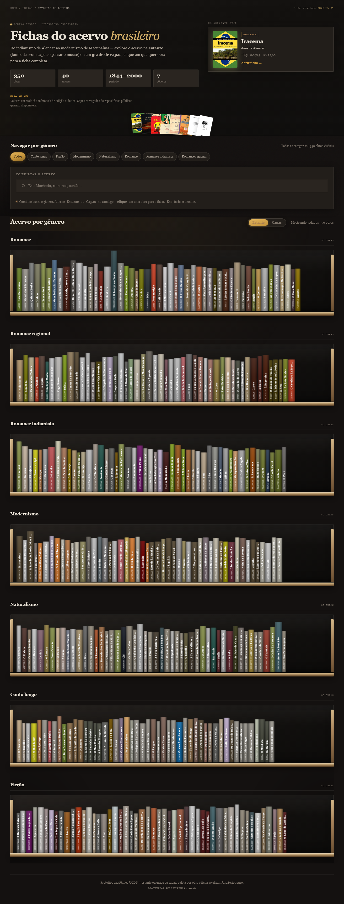
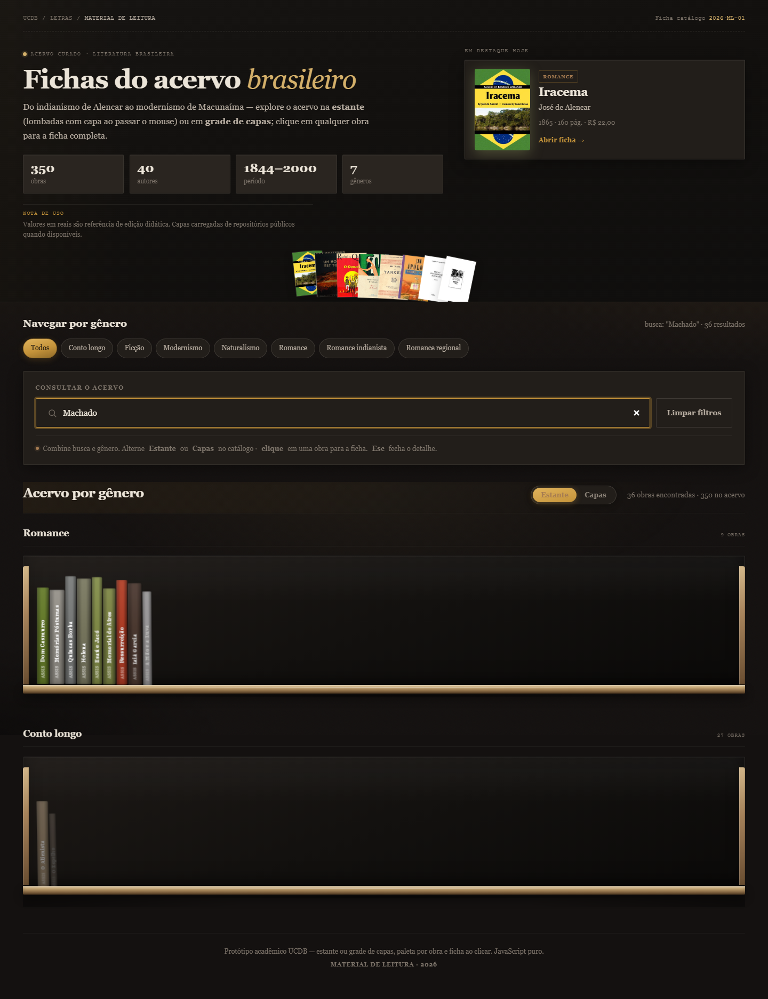
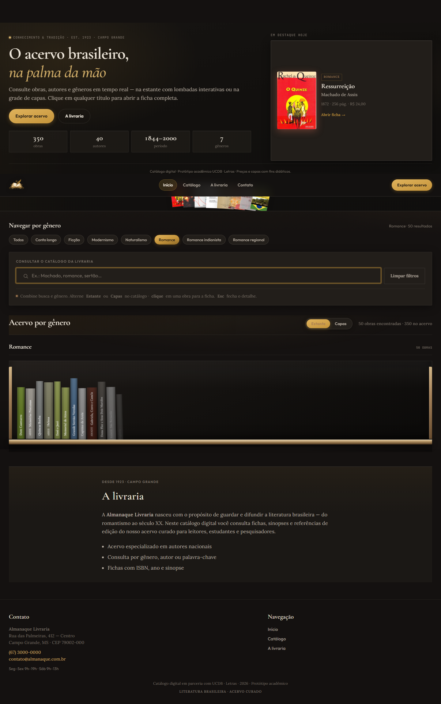
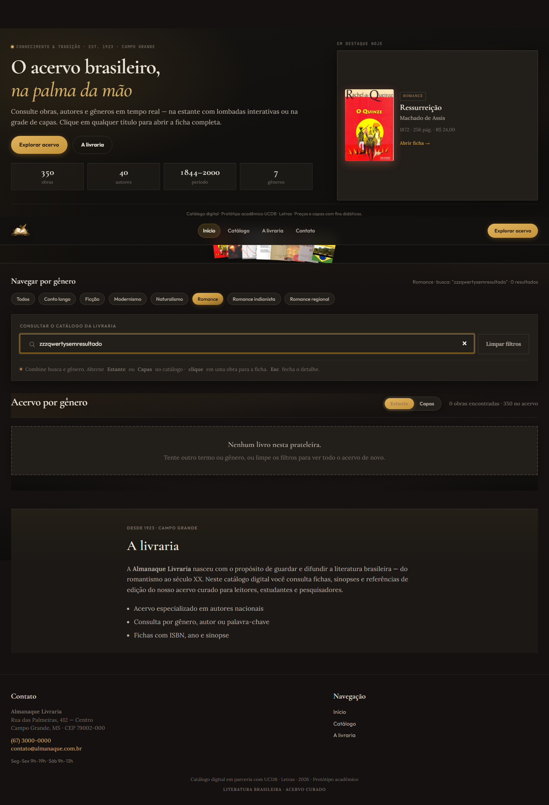
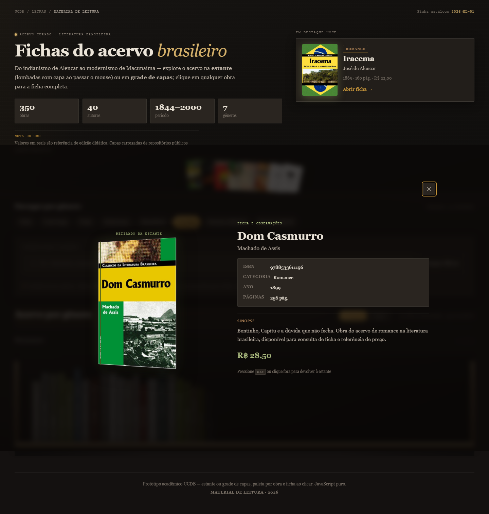
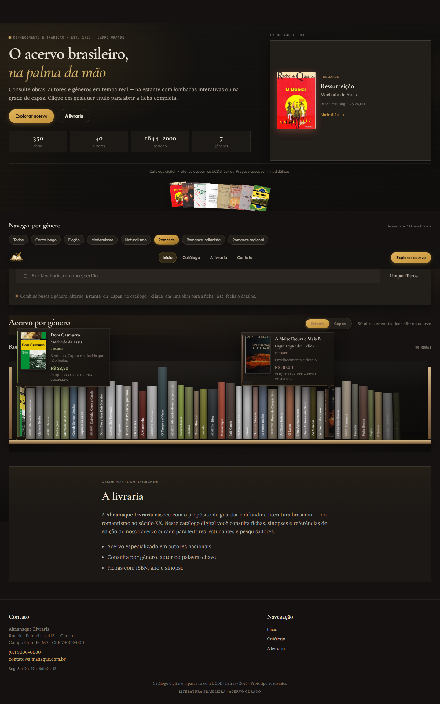

<div align="center">


<br />

**Livraria Almanaque** · catálogo digital de literatura brasileira · UCDB 2026 (Letras)

<br />

[](https://developer.mozilla.org/docs/Web/HTML)
[](https://developer.mozilla.org/docs/Web/CSS)
[](https://developer.mozilla.org/docs/Web/JavaScript)
[](https://www.python.org/)

<br />

[Tour da interface](#tour-pela-interface) ·
[Galeria](#galeria-completa) ·
[Como executar](#como-executar) ·
[Stack](#stack) ·
[Estrutura](#estrutura-do-repositório)

</div>

---

## Sobre o projeto

O site da **Livraria Almanaque** é um protótipo web **estático** (HTML, CSS e JavaScript puro) — catálogo digital para explorar um **acervo de obras da literatura brasileira**. Os dados ficam em memória (`dados-acervo.js`); a interface **reage em tempo real** a buscas e filtros, **sem recarregar a página** — recriando os nós do DOM a cada interação.

> Aplicação acadêmica com dados fictícios/referência didática. Não substitui sistemas oficiais da biblioteca.

### Funcionalidades

| Recurso | O que faz |
|---------|-----------|
| **Hero e estatísticas** | Resumo do acervo (obras, autores, período, gêneros) e destaque do dia |
| **Navegação por gênero** | Chips para filtrar por categoria literária |
| **Busca instantânea** | Filtra por título, autor, categoria ou trechos da sinopse |
| **Estante / Capas** | Dois modos de visualização (lombadas 3D ou grade de capas) |
| **Ficha da obra** | Modal com capa, metadados, sinopse e preço de referência |
| **Estado vazio** | Mensagem e botão **Limpar filtros** quando nada corresponde à busca |

### Fluxo resumido

```
Abrir catálogo → (opcional) escolher gênero → digitar busca → alternar Estante/Capas → clicar na obra → ficha modal
```

---

## Tour pela interface

Cada captura abaixo mostra uma parte do protótipo e o que ela representa no fluxo de consulta ao acervo.

---

### 1. Hero e visão estante



Página inicial com **cabeçalho editorial** (trilha UCDB · Letras, estatísticas do acervo, obra em destaque) e o catálogo no modo **Estante**: obras agrupadas por gênero em prateleiras, com lombadas que revelam a capa ao passar o mouse.

---

### 2. Modo grade de capas


Alternância para **Capas**: grade responsiva com imagem, título, autor e preço de referência. O modo escolhido é lembrado na sessão (`sessionStorage`).

---

### 3. Busca em tempo real



Campo **Consultar o acervo** com filtro ativo (ex.: “Machado”). A cada tecla o script aplica `Array.prototype.filter` e **re-renderiza** a lista — sem `location.reload`. O contador de resultados atualiza na mesma seção.

---

### 4. Filtro por gênero



Chips em **Navegar por gênero** restringem o acervo a uma categoria (ex.: Romance). A busca textual pode ser combinada com o gênero selecionado.

---

### 5. Nenhum resultado



Quando o filtro não encontra obras, a seção entra no estado **sem resultados**: mensagem orientativa e botão **Limpar filtros** (ou tecla **Esc** no campo). Demonstra tratamento de conjunto vazio no DOM.

---

### 6. Ficha da obra (modal)



Ao clicar em um livro, abre o **modal** com capa em destaque, ISBN, categoria, ano, páginas, sinopse e valor em reais (referência didática). Fechar: **Esc**, clique no fundo ou no botão ✕.

---

### 7. Detalhe da estante



Recorte das **prateleiras** com rótulo de gênero, quantidade de títulos e fileira horizontal de lombadas — reforça a metáfora de biblioteca física do protótipo.

---

## Galeria completa

Todas as capturas do protótipo, em ordem, para consulta rápida ou uso em slides.

<table>
  <tr>
    <td align="center" width="33%">
      <a href="docs/screenshots/01-hero-estante.png"></a><br/>
      <sub><b>01</b> · Hero · estante</sub>
    </td>
    <td align="center" width="33%">
      <a href="docs/screenshots/02-modo-capas.png"></a><br/>
      <sub><b>02</b> · Modo capas</sub>
    </td>
    <td align="center" width="33%">
      <a href="docs/screenshots/03-busca-machado.png"></a><br/>
      <sub><b>03</b> · Busca</sub>
    </td>
  </tr>
  <tr>
    <td align="center">
      <a href="docs/screenshots/04-filtro-genero.png"></a><br/>
      <sub><b>04</b> · Gênero</sub>
    </td>
    <td align="center">
      <a href="docs/screenshots/05-sem-resultados.png"></a><br/>
      <sub><b>05</b> · Sem resultados</sub>
    </td>
    <td align="center">
      <a href="docs/screenshots/06-modal-ficha.png"></a><br/>
      <sub><b>06</b> · Modal ficha</sub>
    </td>
  </tr>
  <tr>
    <td align="center" colspan="3">
      <a href="docs/screenshots/07-estante-detalhe.png"></a><br/>
      <sub><b>07</b> · Estante · detalhe</sub>
    </td>
  </tr>
</table>

> Clique em qualquer imagem para abrir em tamanho original. Arquivos em [`docs/screenshots/`](docs/screenshots/).

---

## Stack

| Camada | Tecnologias |
|--------|-------------|
| **Interface** | HTML5 · CSS3 (variáveis, grid, animações) · JavaScript (ES5+, IIFE) |
| **Dados** | Array `PRODUTOS_ACERVO` em `dados-acervo.js` (gerado/atualizado por scripts Python) |
| **Capas** | Open Library (ISBN) · Wikimedia · fallback SVG local |
| **Servidor local** | `python -m http.server` (porta 8765) |
| **Utilitários** | Scripts Python para acervo, auditoria e captura de prints (Playwright) |

---

## Como executar

### Pré-requisitos

- Navegador moderno (Chrome, Edge ou Firefox)
- [Python 3](https://www.python.org/) no PATH (para o servidor local)

### Opção 1 — Atalho Windows (recomendado)

Duplo clique em **`servidor-local.bat`** na raiz do projeto.

Abra no navegador: **http://127.0.0.1:8765/index.html**

> A porta **8765** evita conflito com o Live Server do VS Code (5500).

### Opção 2 — Linha de comando

```powershell
git clone https://github.com/FenixMaker/catalogo-dinamico-ucdb.git
cd catalogo-dinamico-ucdb
python -m http.server 8765
```

Depois acesse **http://127.0.0.1:8765/index.html**

### Opção rápida (sem servidor)

Duplo clique em **`index.html`**. Se fontes ou capas externas falharem, prefira a opção com `http://`.

<details>
<summary><b>Regenerar capturas de tela</b></summary>

<br/>

```powershell
pip install playwright
python -m playwright install chromium
python scripts/capturar-screenshots.py
```

As imagens são salvas em `docs/screenshots/`.

</details>

---

## Contas de demonstração

Este protótipo **não possui login** nem perfis de usuário — é um catálogo público estático. Toda a navegação está disponível ao abrir a página.

---

## Documentação auxiliar

| Arquivo | Descrição |
|---------|-----------|
| [COMO_USAR_E_APRESENTAR.md](COMO_USAR_E_APRESENTAR.md) | Roteiro de apresentação e glossário para a banca |
| [entrega-tecnica.md](entrega-tecnica.md) | Notas técnicas da entrega |
| [docs/screenshots/](docs/screenshots/) | Capturas de tela do protótipo |
| [docs/brand/GUIA-LOGO.md](docs/brand/GUIA-LOGO.md) | Identidade visual da livraria |
| [docs/README.md](docs/README.md) | Índice da documentação |
| [scripts/README.md](scripts/README.md) | Utilitários Python (acervo, capas, prints) |

---

## Estrutura do repositório

```
catalogo-dinamico/
├── index.html                  # Estrutura da página
├── styles.css                  # Visual editorial (estante, modal, hero)
├── app.js                      # Filtros, renderização DOM, modal
├── dados-acervo.js             # Array de obras (350 títulos)
├── obras-por-genero.json       # Fonte JSON do acervo
├── capas/fallback.svg          # Capa padrão quando externa falha
├── docs/
│   ├── README.md               # Índice da documentação
│   ├── brand/                  # Logo e guia de identidade
│   └── screenshots/            # Prints do protótipo
├── scripts/
│   ├── README.md               # Como rodar os utilitários
│   ├── capturar-screenshots.py # Gera PNGs para docs/screenshots/
│   ├── acervo/                 # Pipeline dados-acervo.js
│   └── capas/                  # Busca e auditoria de capas
├── servidor-local.bat          # Sobe http.server na porta 8765
├── iniciar-catalogo.bat        # Alias do servidor
├── COMO_USAR_E_APRESENTAR.md   # Roteiro de apresentação
└── entrega-tecnica.md          # Notas técnicas da entrega
```

---

## Publicar no GitHub

Repositório: **https://github.com/FenixMaker/catalogo-dinamico-ucdb**

Para enviar novas alterações:

```powershell
git add .
git commit -m "Sua mensagem"
git push
```

---

<div align="center">

**Livraria Almanaque** · UCDB 2026 · Letras

*Livraria fictícia · catálogo acadêmico (referência didática)*

</div>
